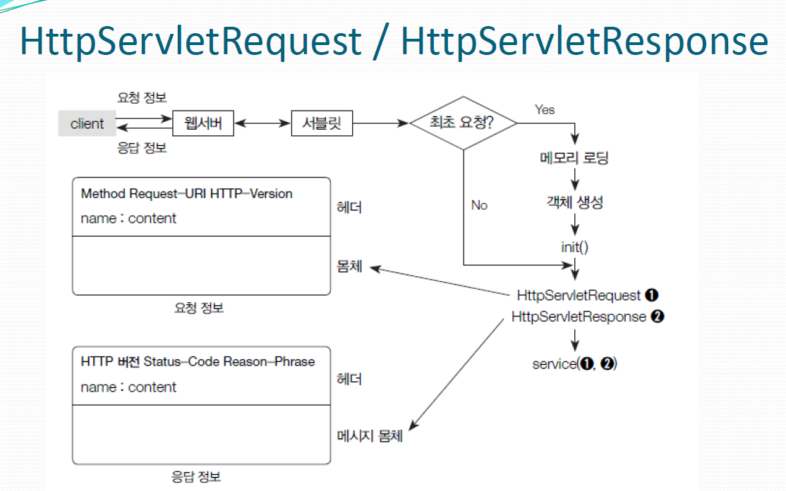

# intellij & tomcat

intellij community 버전은 tomcat을 사용하려면 plugin install 이 필요하다.

이 글은 smart tomcat을 사용하였다.

## 환경
- Java8
- Tomcat 8.0.44
- Servlet 3.1.0

### tomcat

tomcat 공식 사이트에서 제공하는 8.x.x 버전 tomcat이다. 본인이 사용하고 싶은 버전을 다운받으면 된다.
[tomcat 8](https://tomcat.apache.org/download-80.cgi)

### servlet

intellij community 는 servlet을 사용하려면 직접 세팅을 해줘야 한다. 나의 경우 maven repo 에서 import 하였다.

project structure -> Libraries -> import new -> java.servlet 검색후 3.1.0 버전을 import 하였다. 

## 프로젝트 구조

context path 지정후 프로젝트 세팅을 해주자.

프로젝트 구조는 다음과 같이 세팅하였다.
```text
├─.idea                          
│  └─libraries
├─out
│  └─production
│      └─tom
│          └─main
│              └─webapps
│                  ├─math
│                  └─WEB-INF
└─src
    └─main
        └─webapps
            ├─math
            └─WEB-INF
```

## Servlet
servlet 멤버변수는 공유된다.

override 하지 않은 경우
init -> service(ServletRequest...) -> service(HttpServletRequest) -> doGet

서블릿 실행순서
client -> WS -> Servlet Container -> first call? ->yes (memory load -> create object -> init call -> service call)
                                                              -> no(service call)

실제로 로그를 보면 처음에만 생성자 call, init 이 실행되고 이후 service call 만 실행된다.

```log
2024-02-26T13:06:49.213 : SecondServlet constructor call
2024-02-26T13:06:49.213 : SecondServlet init call
2024-02-26T13:06:49.216 : SecondServlet service call
2024-02-26T13:06:49.952 : SecondServlet service call
2024-02-26T13:06:50.809 : SecondServlet service call
```
### servlet logic



service 실행전 HttpServletRequest, HttpServletResponse가 생성이 되고
종료후 삭제된다.

```java
package com.edu.test;

import java.time.LocalDateTime;
import java.io.IOException;
import java.io.PrintWriter;

import javax.servlet.*;
import javax.servlet.annotation.WebServlet;
import javax.servlet.http.*;

@WebServlet("/hello2")
public class SecondServlet extends HttpServlet{
	
	public SecondServlet(){
		System.out.println(LocalDateTime.now() + " : " + "Second Servlet");
	}
	
	public void init(ServletConfig config) throws ServletException{
		System.out.println(LocalDateTime.now() + " : " + "Second Servlet init call");
	}

	@Override
	protected void service(HttpServletRequest req, HttpServletResponse res) throws ServletException, IOException {
		// TODO Auto-generated method stub
		System.out.println(LocalDateTime.now() + " : " + "Second Servlet service call");
		PrintWriter writer = res.getWriter();
		writer.print("<html><head><title>Insert title here</title></head>");
		writer.print("<body>this is writer</body>");
		writer.print("</html>");
	}
}
```

curl http://localhost:9090/edu/hello2 명령어 실행시 다음과 같이 결과가 나온다.
```text
StatusCode        : 200
StatusDescription : OK
Content           : {60, 104, 116, 109...}
RawContent        : HTTP/1.1 200 OK
                    Content-Length: 85
                    Date: Mon, 26 Feb 2024 04:42:19 GMT
                    Server: Apache-Coyote/1.1

                    <html><head><title>Insert title here</title></head><body>this is writer</body></html>
Headers           : {[Content-Length, 85], [Date, Mon, 26 Feb 2024 04:42:19 GMT], [Server, Apache-Coyote/1.1]}
RawContentLength  : 85
```
다음은 doGet을 override 하여 사이트 접속시 정보를 요청하는 것이다.
```java
import javax.servlet.ServletException;
import javax.servlet.annotation.WebServlet;
import javax.servlet.http.HttpServlet;
import javax.servlet.http.HttpServletRequest;
import javax.servlet.http.HttpServletResponse;
import java.io.IOException;
import java.io.PrintWriter;
import java.time.LocalDateTime;

@WebServlet("/netInfo")
public class NetInfoServlet extends HttpServlet {

    public NetInfoServlet() {
        System.out.println(LocalDateTime.now() + " : " + "NetInfo Servlet constructor call");
    }

    @Override
    protected void doGet(HttpServletRequest req, HttpServletResponse resp) throws ServletException, IOException {
        System.out.println("Call by GET");
        resp.setContentType("text/html; charset=utf-8");
        PrintWriter writer = resp.getWriter();
        writer.print("<h1>Client request this uri by GET!");
        writer.print("<h1>Request Scheme : " + req.getScheme());
        writer.print("<h1>Request Method : " + req.getMethod());
        writer.print("<h1>Request Remote User : " + req.getRemoteUser());
        writer.print("<h1>Request Addr : " + req.getRemoteAddr());
        writer.print("<h1>Request Host : " + req.getRemoteHost());
        writer.print("<h1>Request Port : " + req.getRemotePort());
        writer.close();
    }
}
```
curl http://localhost:9090/edu/netInfo 요청시 결과는 다음과 같다.
```text
StatusCode        : 200
StatusDescription : OK
Content           : <h1>Client request this uri by GET!<h1>Request Scheme : http<h1>Request Method : GET<h1>Request Remote User : null<h1>Request Addr : 0:0:0:0:0:0:0:1<h1>Request 
                     Host : 0:0:0:0:0:0:0:1<h1>Request Port :...
```


### 유지기간 분류


- ServletContext : 서버 시작시, 서버 종료시, web application 단위로 사용
- HttpSession : client 접속시, client 종료시, client
- HttpServletRequest : 요청시, 응답시, request